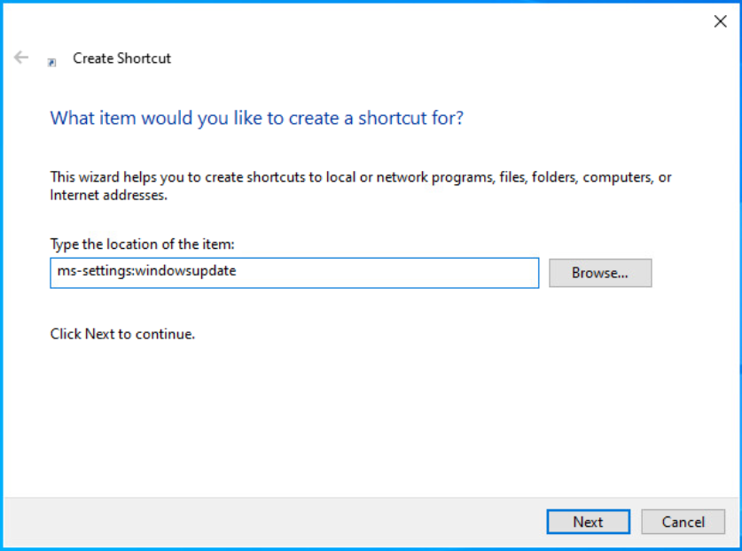
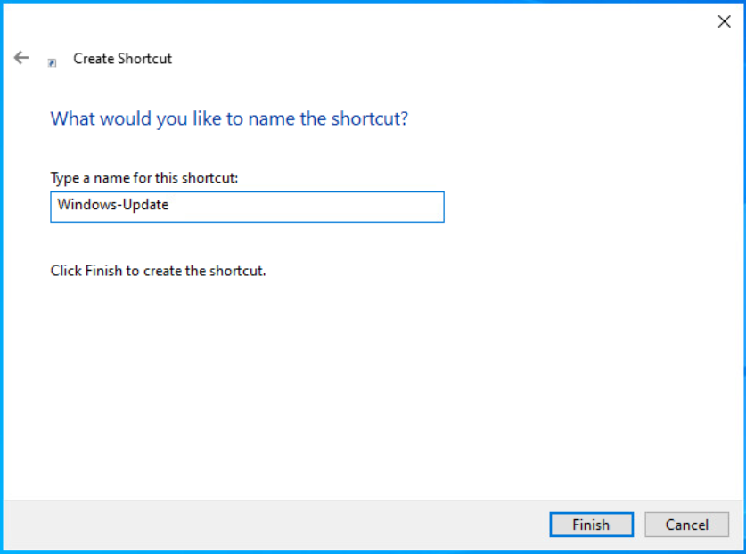

# Creating a shortcut to access the windows update diaglogue directly
As part of the improved *user experiance* Microsoft moves many functions from well known menues to *somewhere in the machine*, so accessing basic function such as "doing updates" requires a higher level of expertise to do.

Creating a shortcut, that allows to access the update process directly bypasses Redmond's plan ;-)

To participate in this do

1) start the explorer or just click on the desktop with a right button click
2) select *"New => Shortcut"* 
  
3) Enter `ms-settings:windows-update` in the *Type the location of the item* field  
  
4) Enter a name for your shortcut, e.g. *Windows Update* 
  
5) Done! 
  
